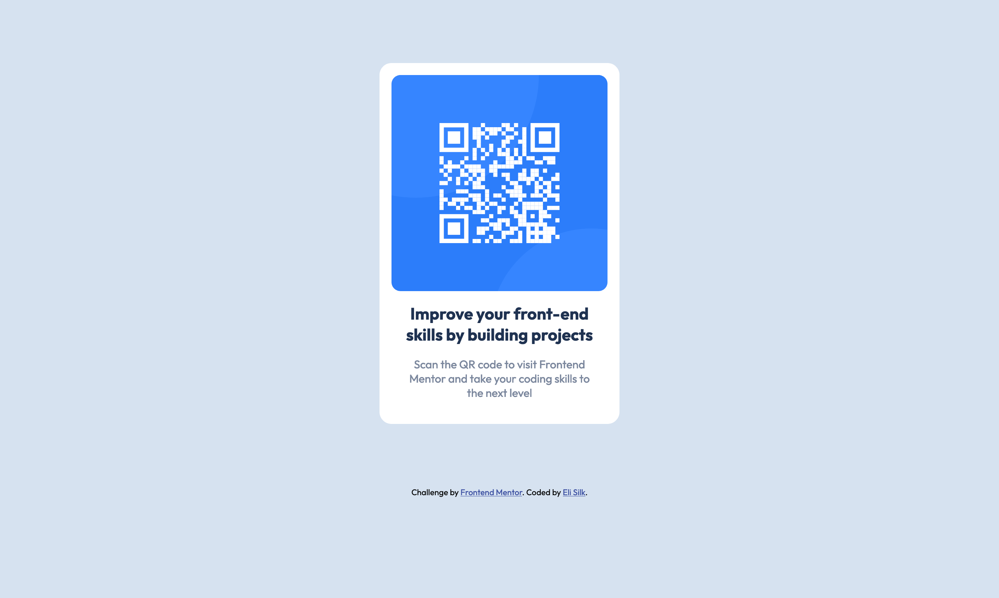

# Frontend Mentor - QR code component solution

This is a solution to the [QR code component challenge on Frontend Mentor](https://www.frontendmentor.io/challenges/qr-code-component-iux_sIO_H). Frontend Mentor challenges help you improve your coding skills by building realistic projects.

## Table of contents

- [Overview](#overview)
  - [Screenshot](#screenshot)
  - [Links](#links)
- [My process](#my-process)
  - [Built with](#built-with)
  - [What I learned](#what-i-learned)
  - [Continued development](#continued-development)
  - [Useful resources](#useful-resources)
- [Author](#author)
- [Acknowledgments](#acknowledgments)

## Overview

### Screenshot



### Links

- Solution URL: [https://github.com/elisilk/qr-code-component](https://github.com/elisilk/qr-code-component)
- Live Site URL: [https://elisilk.github.io/qr-code-component/](https://elisilk.github.io/qr-code-component/)

## My process

### Built with

- Semantic HTML5 markup
- CSS custom properties
- Mobile-first workflow
- [BEM](https://getbem.com/) - component naming convention

### What I learned

I used the project as an opportunity to implement a basic BEM (block element modifier) component in CSS.

```html
<section class="card">
  
  <h1 class="card__title">
    Improve your front-end skills by building projects
  </h1>
  <p class="card__description">
    Scan the QR code to visit Frontend Mentor and take your coding skills to the
    next level
  </p>
</section>
```

### Continued development

I'd like to look more into the correct use of the heading elements. On the one hand, my understanding was that there should be a single h1 on each page and that you shouldn't skip over any heading levels. On the other hand, this is just a single component, and in practice, it is likely to be used as a part of a larger page (that is likely to have its own h1 element). And if that's the case, then it's hard to know where in the heading levels the component will live.

It seems like the HTML5 specification allows for an h1 in each section of a page. See, for example:

> When a heading is nested in a document banner `<header>`, it is the heading for the application or site. When nested in `<main>`, whether or not it is nested within a `<header>` in `<main>`, it is the header for that page, not the whole site. When nested in an `<article>` or `<section>`, it is the header for that subsection of the page.

Citation [web.dev](https://web.dev/learn/html/headings-and-sections#headings_h1-h6)

But there does seem to be some debate about whether that has been implemented and so the current recommendation is to have only a single h1 per page.

> While using multiple `<h1>` elements on one page is allowed by the HTML standard (as long as they are not nested), this is not considered a best practice. A page should generally have a single `<h1>` element that describes the content of the page (similar to the document's `<title>` element).

Citation [MDN Web Docs](https://developer.mozilla.org/en-US/docs/Web/HTML/Element/Heading_Elements#avoid_using_multiple_h1_elements_on_one_page)

So, I'm not sure. Will have to do more reading. Some resources to check out could be:

- [HTML for Subheadings and Headings](https://css-tricks.com/html-for-subheadings-and-headings/)
- [Layout Cookbook - Card](https://developer.mozilla.org/en-US/docs/Web/CSS/Layout_cookbook/Card)

I also learned to be careful that [all page content should be contained by landmarks](https://dequeuniversity.com/rules/axe/4.6/region?application=axeAPI). Thanks for the Frontend Mentor validators for catching that error I initially made.

### Useful resources

- [BEM](https://getbem.com/) - Blocks, Elements and Modifiers
- [What heading level to use?](https://developer.mozilla.org/en-US/docs/Web/HTML/Element/Heading_Elements)

## Author

- Website - [Eli Silk](https://github.com/elisilk)
- Frontend Mentor - [@elisilk](https://www.frontendmentor.io/profile/elisilk)

## Acknowledgments

I definitely want to acknowledge [Kevin Powell](https://www.kevinpowell.co/). Kevin's email newsletter inspired me to give Frontend Mentor a try, and his YouTube video of another Frontend Mentor challenge was the model I used to develop my own solution to this challenge.

And thank you [@Ezekiel225](https://www.frontendmentor.io/profile/Ezekiel225) for leaving me [super helpful feedback with some concrete suggestions for improvement](https://www.frontendmentor.io/solutions/card-component-using-bem-and-css-custom-properties-4MgLuLV-0M).
